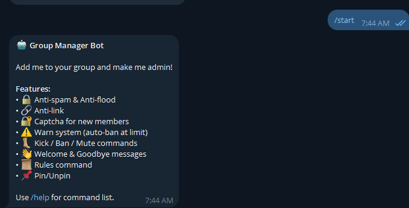

# 🛡️ Telegram Group Manager Bot

A powerful Telegram group management bot with anti-spam, captcha verification, warn/ban/mute system, anti-link protection, and welcome messages. Keep your groups clean and safe automatically.


## 📸 Screenshot

<p align="center">
  
</p>

## ✨ Features

- 🔒 **Anti-Spam** — Auto-detect and mute/ban spammers
- 🔐 **Captcha** — Math captcha for new members (auto-kick if failed)
- 🔗 **Anti-Link** — Auto-delete links from non-admins
- 🌊 **Anti-Flood** — Detect repeated messages
- ⚠️ **Warn System** — Warn users, auto-ban at limit (configurable)
- 👢 **Kick/Ban/Mute** — Full moderation commands
- 👋 **Welcome Message** — Custom welcome for new members
- 📜 **Rules** — Set and display group rules
- 📌 **Pin/Unpin** — Pin messages via command
- 🚫 **Word Filter** — Block specific words
- 🌙 **Night Mode** — Auto-lock group at night (optional)
- 🪶 **Lightweight** — Single dependency, JSON storage

## 🚀 Quick Start

### Installation

```bash
git clone https://github.com/yourusername/telegram-group-manager-bot.git
cd telegram-group-manager-bot
```

**Windows:**
```
Double-click BUILD.bat
```

**Manual:**
```bash
pip install -r requirements.txt
```

### Configuration

Edit `config.py`:

```python
TELEGRAM_BOT_TOKEN = "your-bot-token"
OWNER_ID = 123456789  # Your Telegram user ID
```

### Run

```
Double-click START.bat
```

### Setup in Group

1. Add bot to your group
2. Make bot **admin** with all permissions
3. Done! Bot starts protecting automatically

## 📖 Commands

### Admin Commands (reply to user)

| Command | Description |
|---------|-------------|
| `/warn` | Warn a user |
| `/unwarn` | Reset user's warns |
| `/ban` | Ban a user |
| `/unban` | Unban a user |
| `/mute` | Mute a user |
| `/unmute` | Unmute a user |
| `/kick` | Kick a user (can rejoin) |
| `/pin` | Pin a message |
| `/unpin` | Unpin all messages |
| `/setrules` | Set group rules |

### Everyone

| Command | Description |
|---------|-------------|
| `/start` | Bot info |
| `/help` | Command list |
| `/rules` | Show group rules |
| `/info` | Bot stats |

## 🔧 Configuration Options

| Setting | Default | Description |
|---------|---------|-------------|
| `WELCOME_ENABLED` | True | Send welcome message |
| `ANTISPAM_ENABLED` | True | Detect spam |
| `SPAM_THRESHOLD` | 5 | Messages per 10s before action |
| `SPAM_ACTION` | mute | Action: mute/warn/kick/ban |
| `MUTE_DURATION_MINUTES` | 5 | Mute duration |
| `ANTILINK_ENABLED` | True | Delete links |
| `FLOOD_THRESHOLD` | 3 | Same message repeats |
| `CAPTCHA_ENABLED` | True | Captcha for new members |
| `CAPTCHA_TIMEOUT` | 60 | Seconds to solve |
| `CAPTCHA_FAIL_ACTION` | kick | Action if failed |
| `MAX_WARNS` | 3 | Warns before final action |
| `WARN_ACTION` | ban | Action at max warns |
| `WORDFILTER_ENABLED` | False | Block words |

## 📁 Project Structure

```
telegram-group-manager-bot/
├── bot.py              # Main bot (all handlers)
├── config.py           # Configuration
├── database.py         # JSON database
├── requirements.txt    # Dependencies
├── BUILD.bat           # Installer
├── START.bat           # Launcher
└── database.json       # Data (auto-created)
```

## 🔐 How Captcha Works

1. New user joins group
2. Bot mutes them immediately
3. Shows math question: "What is 3 + 7 = ?"
4. User clicks correct answer → unmuted
5. Wrong answer → kicked/banned (configurable)
6. Timeout → kicked (configurable)

## ⚠️ Important

- Bot must be **admin** with all permissions
- Bot cannot warn/ban/mute other admins
- Owner (OWNER_ID) cannot be warned/banned

## 📄 License

MIT License — free to use and modify.

## ⭐ Star This Repo

If useful, give it a ⭐!
